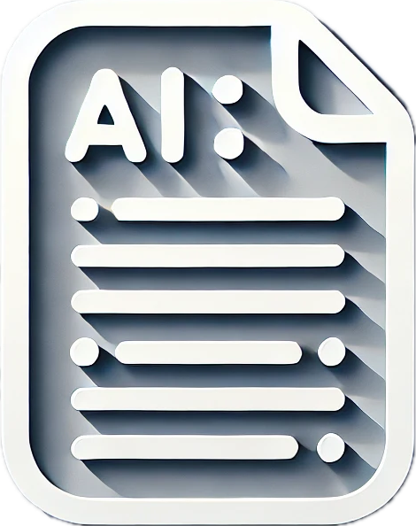
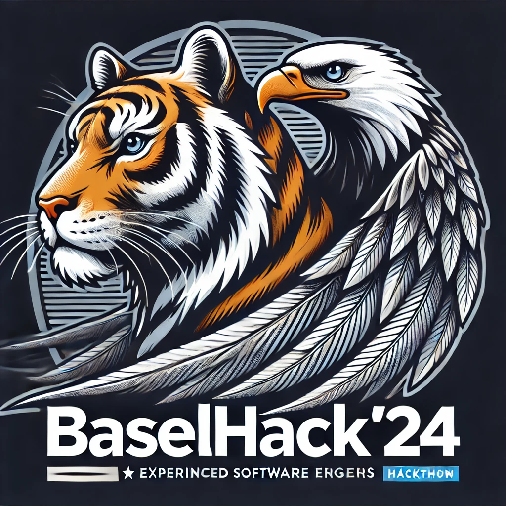

# Too Long! - EAGER Team at BaselHack24

**Too Long!** is a cross-platform media summarization tool developed by the **EAGER** team during BaselHack24. It simplifies video content consumption by providing real-time summaries for YouTube videos across multiple platforms.

## 💡 What We Built

- **Backend**: A central backend that powers all platforms.
- **Telegram Bot**: Provides video summaries through link submissions.
- **Discord Bot**: Summarizes YouTube videos directly within Discord chats.
- **Chrome Extension**: Enables one-click video summarization on YouTube.
- **Web App**: A user-friendly dashboard to manage and track summaries.

All services access the same backend, ensuring fast and consistent summaries.

## 🚀 Key Features

- **Cross-Platform Access**: Chrome, Telegram, Discord, and Web App support.
- **Real-Time Summaries**: Quickly summarize YouTube videos for efficient content consumption.

## 📂 How It Works

1. **Telegram & Discord Bots**: Users submit a YouTube link, and the bot returns a summarized version of the video.
2. **Chrome Extension**: Users click on a button directly on YouTube to generate and view the summary.
3. **Web App**: A dashboard to review past summaries, track usage, and manage settings.

---

For more details on the ideation and preparation process, check out our **[Warplan Repository](https://github.com/reactbias/BaselHack24-EAGER)**.

---

This project was built by the EAGER team for BaselHack24. Enjoy consuming content faster with **Too Long!**

